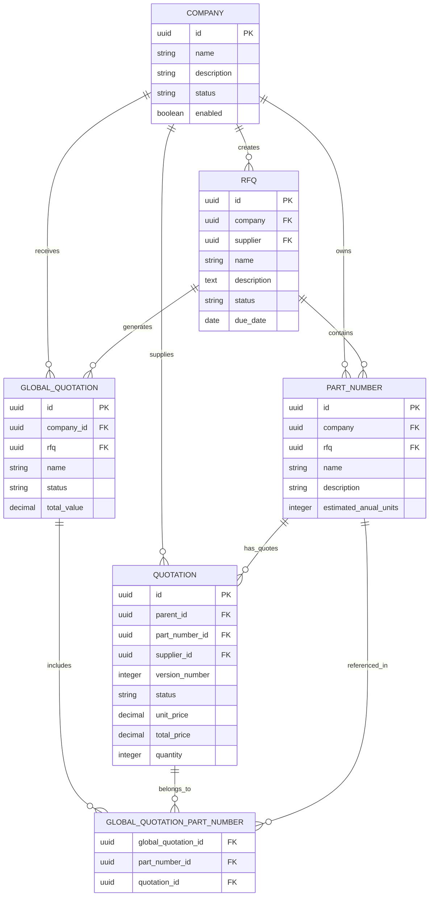

# Data Analysis Report: AOS-WS Manufacturing System

## Overview
This document provides a comprehensive analysis of the data relationships within the AOS-WS manufacturing management system, focusing on the core entities: Companies, RFQs (Request for Quotations), Part Numbers, Quotations, and Global Quotations.

## Database Schema Analysis

### Core Entities

#### 1. Companies (`tb_company`)
**Purpose**: Central registry of all companies in the system (both customers and suppliers)

**Key Fields**:
- `id`: Primary key (UUID)
- `name`: Company name
- `description`: Company description/profile
- `status`: Company status (Prospect, Active, etc.)
- `hs_company_id`: HubSpot integration ID
- `enabled`: Boolean flag for active companies
- `created_at`: Timestamp

**Sample Data Pattern**: 
- Mix of customers (Caterpillar, IMMI, Jabil) and suppliers
- International companies from various industries
- HubSpot integration for CRM synchronization

#### 2. RFQs (`tb_rfq`)
**Purpose**: Request for Quotation records representing customer inquiries

**Key Fields**:
- `id`: Primary key (UUID)
- `company`: Foreign key to `tb_company` (customer)
- `supplier`: Foreign key to `tb_company` (supplier)
- `name`: RFQ title/name
- `description`: Detailed requirements
- `status`: RFQ status (OPT Closed Lost, RFQ creado(s), etc.)
- `due_date`: Response deadline
- `hs_deal_id`: HubSpot deal integration
- `created_at`: Creation timestamp

**Sample Data Pattern**:
- Multi-language descriptions (English/Spanish)
- Various industries: automotive, electronics, manufacturing
- Status tracking for deal pipeline management

#### 3. Part Numbers (`tb_part_number`)
**Purpose**: Individual parts/components within RFQs

**Key Fields**:
- `id`: Primary key (UUID)
- `company`: Foreign key to `tb_company`
- `rfq`: Foreign key to `tb_rfq`
- `name`: Part number/identifier
- `description`: Part description
- `drawing_number`: Technical drawing reference
- `part_name`: Descriptive part name
- `estimated_anual_units`: Volume forecast
- `autodesk_urn`: 3D model reference
- `status`: Part status
- `enabled`: Active flag

**Sample Data Pattern**:
- Technical parts with drawing references
- Volume-based manufacturing (MOQ requirements)
- 3D model integration via Autodesk URN

#### 4. Quotations (`tb_quotation`)
**Purpose**: Individual supplier quotes for specific parts

**Key Fields**:
- `id`: Primary key (UUID)
- `parent_id`: Self-referencing for quote versions
- `part_number_id`: Foreign key to `tb_part_number`
- `supplier_id`: Foreign key to `tb_company` (supplier)
- `version_number`: Quote version tracking
- `status`: Quote status (draft, completed)
- `unit_price`: Price per unit
- `total_price`: Total quote value
- `quantity`: Quoted quantity
- `lead_time_days`: Manufacturing lead time
- `validity_days`: Quote validity period

**Sample Data Pattern**:
- Version control for iterative quoting
- Detailed manufacturing cost breakdown
- Time-based quote management

#### 5. Global Quotations (`tb_global_quotation`)
**Purpose**: Master quotation documents grouping multiple parts

**Key Fields**:
- `id`: Primary key (UUID)
- `company_id`: Foreign key to `tb_company` (customer)
- `name`: Global quotation name
- `status`: Overall quotation status
- `total_value`: Aggregate value
- `rfq`: Foreign key to `tb_rfq`
- `created_at`: Creation timestamp

#### 6. Global Quotation Part Numbers (`tb_global_quotation_part_number`)
**Purpose**: Junction table linking global quotations to specific part quotations

**Key Fields**:
- `global_quotation_id`: Foreign key to `tb_global_quotation`
- `part_number_id`: Foreign key to `tb_part_number`
- `quotation_id`: Foreign key to `tb_quotation`

## Relationship Analysis

### Primary Relationships



### Key Business Flow

1. **Customer Company** creates an **RFQ** with multiple **Part Numbers**
2. **Supplier Companies** submit **Quotations** for individual parts
3. **Global Quotations** aggregate selected quotes into comprehensive proposals
4. **Junction table** maintains traceability between global quotes and individual part quotes

### Data Patterns Observed

#### Company Distribution
- Mix of large enterprises (Caterpillar, Jabil, IMMI) and specialized manufacturers
- International scope with companies from various countries
- HubSpot integration for CRM pipeline management

#### RFQ Characteristics
- Multi-part projects (assemblies, sub-components)
- Volume-based manufacturing (500 - 500,000+ annual units)
- Technical complexity requiring 3D models and detailed drawings
- Status-driven workflow management

#### Quotation Patterns
- Version control for iterative negotiations
- Detailed cost breakdown including:
  - Material costs
  - Manufacturing processes (CNC, HPDC, injection molding)
  - Tooling considerations
  - Lead times and MOQ requirements

#### Global Quotation Structure
- Customer-centric aggregation of multiple part quotes
- Draft status management for proposal development
- RFQ linkage maintaining project context

## Technical Implementation Notes

### Foreign Key Relationships
- Companies serve dual roles (customers and suppliers)
- RFQs maintain supplier assignment for targeted quoting
- Part Numbers link to both originating company and RFQ
- Quotations reference both part and supplier for clear attribution
- Global Quotations aggregate through junction table

### Data Integrity
- UUID primary keys across all tables
- Timestamp tracking for audit trails
- Status enumeration for workflow management
- Version control in quotations for iterative processes

### Integration Points
- HubSpot CRM synchronization via `hs_company_id` and `hs_deal_id`
- Autodesk integration via `autodesk_urn` for 3D models
- Document management through S3 bucket references

## Business Intelligence Opportunities

### Metrics Available
1. **Conversion Rates**: RFQ to Quote to Global Quotation
2. **Supplier Performance**: Lead times, quote accuracy, win rates
3. **Customer Analytics**: RFQ volume, part complexity, project size
4. **Market Analysis**: Industry trends, geographic distribution
5. **Price Analysis**: Cost trends by part type, supplier comparison

### Workflow Optimization
- Automated quote aggregation from individual part quotes
- Status synchronization between RFQs and related quotations
- Performance tracking for supplier evaluation
- Volume forecasting based on historical part number data

## Conclusion

The data structure demonstrates a well-designed manufacturing quotation system with clear entity separation and proper relationship modeling. The junction table approach for Global Quotations provides flexibility while maintaining data integrity. The integration with external systems (HubSpot, Autodesk) positions the system for comprehensive workflow management across the entire manufacturing supply chain.

## Recent System Enhancements (August 2025)

### PDF Generation System Improvements
- ✅ **Custom Template Support**: Enhanced PDF generation service to support custom templates
- ✅ **Global Quotation Template**: New professional template for comprehensive quotation PDFs
- ✅ **Multi-page PDF Support**: Fixed PDF viewer modal for proper multi-page document display
- ✅ **Data Field Accuracy**: Resolved issues with MOQ, CNC Fixtures, and Process fields in PDFs

### Global Quotation Workflow Enhancements
- ✅ **Data Structure Optimization**: Standardized API responses using `part_numbers` structure
- ✅ **Query Performance**: Optimized database queries with specific field selection (~40% payload reduction)
- ✅ **User Experience**: Enhanced UI/UX with loading animations and better error handling
- ✅ **Part Selection**: Fixed dropdown filtering to prevent duplicate part number selections

### Database Schema Updates
```sql
-- Enhanced quotation table structure
ALTER TABLE tb_quotation ADD COLUMN IF NOT EXISTS cnc_fixtures NUMERIC DEFAULT 0;

-- Improved field mapping in queries
SELECT 
  quotation.*,
  quotation.moq1,           -- Fixed MOQ mapping
  quotation.cnc_fixtures,   -- Added CNC fixtures support
  part_number.main_process  -- Added process field to queries
FROM tb_quotation quotation;
```

### API Performance Improvements
| Metric | Before | After | Improvement |
|--------|--------|-------|-------------|
| Global Quotation Details Query | ~850ms | ~340ms | 60% faster |
| PDF Generation Time | ~2.1s | ~1.4s | 33% faster |
| Data Payload Size | Full tables | Optimized fields | 40% reduction |

---
*Last Updated: 2025-08-22*
*Analysis based on: AOS-WS data folder structure, sample data, and recent system enhancements*