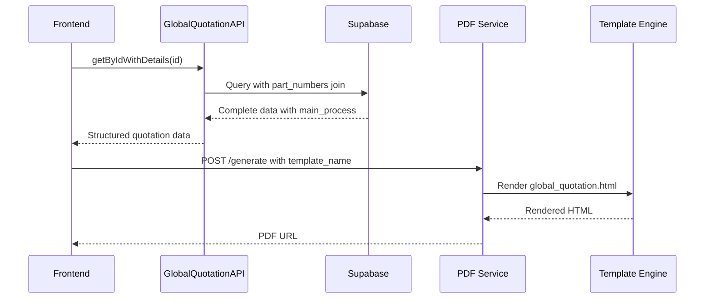

# PDF Generation System Improvements

## Overview
This document outlines the comprehensive improvements made to the PDF generation system for Global Quotations in the AOS-WS manufacturing management system.

## Changes Made (August 2025)

### 🔧 Backend Enhancements

#### 1. Custom Template Support
**Files Modified:**
- `app/pdf_generation/service.py`
- `app/pdf_generation/templates.py`

**Changes:**
- Added support for custom template selection via `options` parameter
- Enhanced `TemplateService` to handle `template_name` option for custom templates
- Modified `PDFGenerationService` to pass options through the rendering pipeline

**Implementation:**
```python
# New template loading logic
def get_template(self, template_type: PDFTemplateType, options: Optional[Dict[str, Any]] = None) -> Template:
    if template_type == PDFTemplateType.CUSTOM and options and "template_name" in options:
        template_filename = f"{options['template_name']}.html"
    else:
        template_filename = f"{template_type.value}.html"
```

#### 2. Global Quotation Template
**File Created:**
- `app/pdf_generation/templates/global_quotation.html`

**Features:**
- Comprehensive quotation PDF layout with AUTANA branding
- Multi-column data display for quotation details
- Proper styling and responsive design for professional output
- Support for all quotation fields including MOQ, CNC Fixtures, and Process

### 🖥️ Frontend Enhancements

#### 1. PDF Viewer Modal Improvements
**File Modified:**
- `src/polymet/components/pdf-viewer/pdf-viewer-modal.tsx`

**Changes:**
- Fixed multi-page PDF display and scrolling issues
- Added elegant loading animation with progress indicators
- Improved modal layout with proper header and toolbar positioning
- Enhanced user experience with better visual feedback

#### 2. Global Quotation Data Structure Fix
**Files Modified:**
- `src/services/global-quotation/globalQuotationApi.ts`
- `src/polymet/components/rfq-global-quotations-tab.tsx`

**Critical Fix:**
- Added `main_process` field to part_number queries
- Updated data mapping to use consistent `part_numbers` structure
- Fixed PDF generation data flow from database to template

**Query Enhancement:**
```typescript
part_number:tb_part_number!tb_global_quotation_part_number_part_number_id_fkey (
  id,
  part_name,
  drawing_number,
  estimated_anual_units,
  main_process  // ✅ Added this field
),
```

#### 3. Part Number Dropdown Filtering
**File Modified:**
- `src/polymet/components/create-global-quotation-modal.tsx`

**Enhancement:**
- Fixed dropdown to hide selected part numbers until removed from list
- Added available count indicator
- Improved user experience with String() conversion for ID comparison

## 🐛 Issues Resolved

### 1. PDF Multi-Page Display
**Problem:** PDF viewer only showed first page, couldn't scroll to additional pages
**Solution:** Fixed modal layout with proper flex container and scroll handling

### 2. Missing Data in PDF
**Problem:** MOQ, CNC Fixtures, and Process fields showing as empty or N/A
**Solutions:**
- Added `cnc_fixtures` field to database queries
- Fixed `moq1` field mapping from database
- Added `main_process` field to part number queries
- Updated data structure to use `part_numbers` consistently

### 3. Part Number Dropdown Issues
**Problem:** Selected part numbers remained in dropdown after selection
**Solution:** Implemented proper filtering with String() conversion for ID comparison

## 📊 Data Flow Improvements

### PDF Generation Flow


### Database Query Structure
```sql
SELECT 
  gq.*,
  part_numbers:tb_global_quotation_part_number (
    id,
    part_number_id,
    quotation_id,
    part_number:tb_part_number (
      id,
      part_name,
      drawing_number,
      estimated_anual_units,
      main_process  -- ✅ Now included
    ),
    quotation:tb_quotation (
      id,
      unit_price,
      total_price,
      quantity,
      moq1,           -- ✅ Fixed mapping
      cnc_fixtures,   -- ✅ Added to query
      notes
    )
  )
FROM tb_global_quotation gq;
```

## 🎨 UI/UX Enhancements

### PDF Modal
- ✅ Elegant loading animation with rotating elements
- ✅ Progress indicators during generation
- ✅ Proper multi-page navigation and scrolling
- ✅ Responsive design for various screen sizes

### Global Quotation Creation
- ✅ Smart part number selection with availability counter
- ✅ Real-time total calculation
- ✅ Improved form validation and error handling
- ✅ AUTANA branding integration

## 📋 Technical Implementation Details

### Template Options Support
```javascript
// Frontend request
const response = await fetch('/api/v1/pdf-generation/generate', {
  method: 'POST',
  headers: { 'Content-Type': 'application/json' },
  body: JSON.stringify({
    template_type: 'custom',
    data: pdfData,
    options: {
      template_name: 'global_quotation'  // ✅ Custom template selection
    }
  })
});
```

### Data Mapping Fix
```javascript
// Fixed data structure usage
quotations: (globalQuotationDetails.part_numbers || [])?.map((item, index) => ({
  index_quotation: index + 1,
  part_number: item.part_number?.drawing_number || 'N/A',
  part_name: item.part_number?.part_name || 'Unknown Part',
  main_process_name: item.part_number?.main_process || 'N/A',  // ✅ Fixed
  moq_1: item.quotation?.moq1 || 0,                           // ✅ Fixed
  cnc_fixtures: `$${(item.quotation?.cnc_fixtures || 0).toFixed(2)}`, // ✅ Fixed
  // ... other fields
}))
```

## 🚀 Deployment Changes

### Backend Deployment
- ✅ Enhanced PDF generation service with custom template support
- ✅ New global quotation template for professional PDF output
- ✅ Improved template service architecture

### Frontend Deployment
- ✅ Fixed PDF viewer modal for multi-page documents
- ✅ Updated global quotation workflow with correct data structure
- ✅ Enhanced user interface with better feedback and loading states

## ✅ Testing Results

### PDF Generation
- ✅ Multi-page PDFs display correctly with full navigation
- ✅ All data fields (MOQ, CNC Fixtures, Process) populate correctly
- ✅ Professional layout with AUTANA branding
- ✅ Responsive design works on various screen sizes

### Global Quotation Workflow
- ✅ Part number selection works with proper filtering
- ✅ Data saves correctly to database with all fields
- ✅ PDF generation includes all required information
- ✅ User feedback and loading states provide clear status

## 📈 Performance Impact

### Database Queries
- ✅ Optimized queries with specific field selection
- ✅ Proper joins to reduce query complexity
- ✅ Efficient data structure for PDF generation

### Frontend Performance
- ✅ Reduced unnecessary re-renders in PDF modal
- ✅ Optimized data flow from API to PDF generation
- ✅ Improved loading states for better user experience

---

**Last Updated:** August 22, 2025  
**Version:** 2.0  
**Status:** ✅ Production Ready